# Домашнее задание к занятию  «Очереди RabbitMQ» Шелухин Юрий

### Задание 1. Установка RabbitMQ

Используя Vagrant или VirtualBox, создайте виртуальную машину и установите RabbitMQ. Добавьте management plug-in и зайдите в веб-интерфейс.   
*Итогом выполнения домашнего задания будет приложенный скриншот веб-интерфейса RabbitMQ.*

---

#### Решение 1.
1. Установим RabbitMQ с помощью контейнеризации.  
`sudo docker-compose -f docker-compose_simple.yml up`  
Через команду `docker ps -a` посмотрим список работающих контейнеров.  
     

2. Обратимся к браузеру по адресу: http://192.168.65.135:15672.    
         

---

### Задание 2. Отправка и получение сообщений

Используя приложенные скрипты, проведите тестовую отправку и получение сообщения. Для отправки сообщений необходимо запустить скрипт producer.py.

Для работы скриптов вам необходимо установить Python версии 3 и библиотеку Pika. Также в скриптах нужно указать IP-адрес машины, на которой запущен RabbitMQ, заменив localhost на нужный IP.

```shell script
$ pip install pika
```

Зайдите в веб-интерфейс, найдите очередь под названием hello и сделайте скриншот.
После чего запустите второй скрипт consumer.py и сделайте скриншот результата выполнения скрипта

*В качестве решения домашнего задания приложите оба скриншота, сделанных на этапе выполнения.*

Для закрепления материала можете попробовать модифицировать скрипты, чтобы поменять название очереди и отправляемое сообщение.

---

#### Решение 2.
1. Установим Python версии 3 и библиотеку Pika.  
`sudo apt install python3-pip`  
`sudo apt install python3.10-venv`  
`pip install pika`
2. Создадим виртуальное окружение.  
`python3 -m venv env`
3.  Для работы в виртуальной среде, активируем её.  
`source env/bin/activate`
4. Откроем скрипт-producer и изменим текст сообщения.
   

5. Запустим скрипт несколько раз, перед этим запустив контейнер RabbitMQ.
`python producer_single.py`   
Не сработало, ошибки.  
Вновь `pip install pika`.  
Вновь `python producer_single.py` несколько раз.  
Посмотрим в веб-интерфейсе очередь под названием hello и сообщения в ней.  
 
 
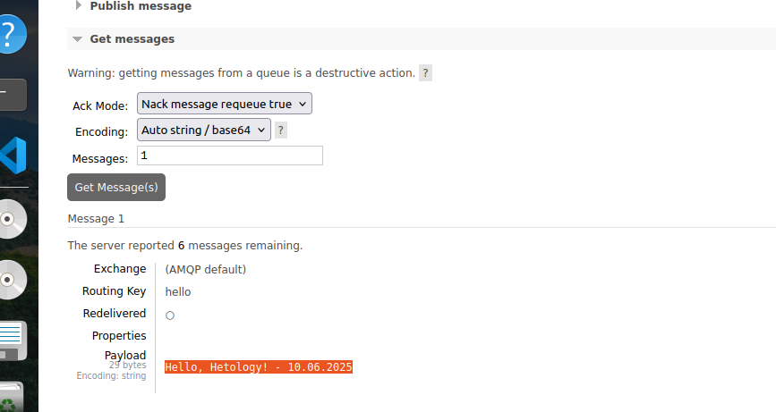 


6. Запустим второй скрипт consumer.py.
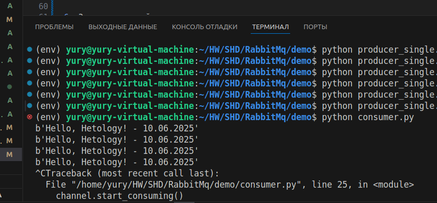 
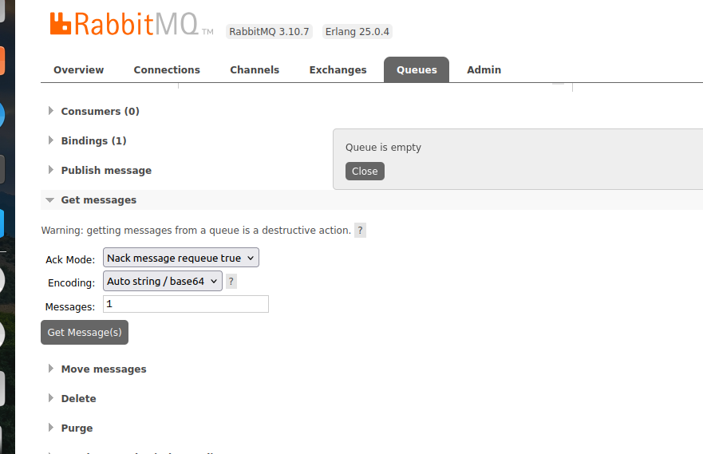

---

### Задание 3. Подготовка HA кластера

Используя Vagrant или VirtualBox, создайте вторую виртуальную машину и установите RabbitMQ.
Добавьте в файл hosts название и IP-адрес каждой машины, чтобы машины могли видеть друг друга по имени.

Пример содержимого hosts файла:
```shell script
$ cat /etc/hosts
192.168.0.10 rmq01
192.168.0.11 rmq02
```
После этого ваши машины могут пинговаться по имени.

Затем объедините две машины в кластер и создайте политику ha-all на все очереди.

*В качестве решения домашнего задания приложите скриншоты из веб-интерфейса с информацией о доступных нодах в кластере и включённой политикой.*

Также приложите вывод команды с двух нод:

```shell script
$ rabbitmqctl cluster_status
```

Для закрепления материала снова запустите скрипт producer.py и приложите скриншот выполнения команды на каждой из нод:

```shell script
$ rabbitmqadmin get queue='hello'
```

После чего попробуйте отключить одну из нод, желательно ту, к которой подключались из скрипта, затем поправьте параметры подключения в скрипте consumer.py на вторую ноду и запустите его.

*Приложите скриншот результата работы второго скрипта.*

---

#### Решение 3
1. Создадим кластер из трех нод с помощью контейнеризации.  
  

Создадим политику ha-all на все очереди.  
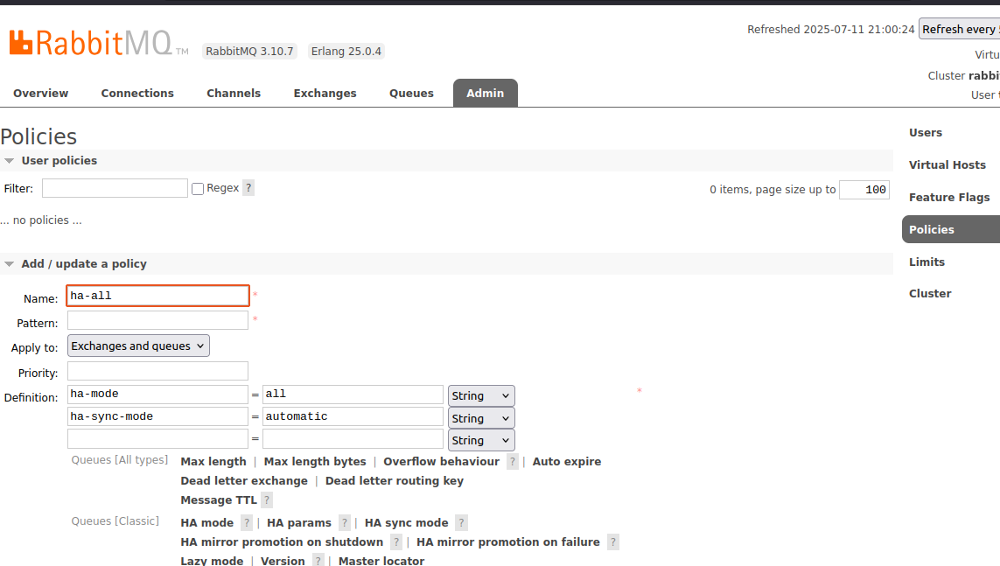
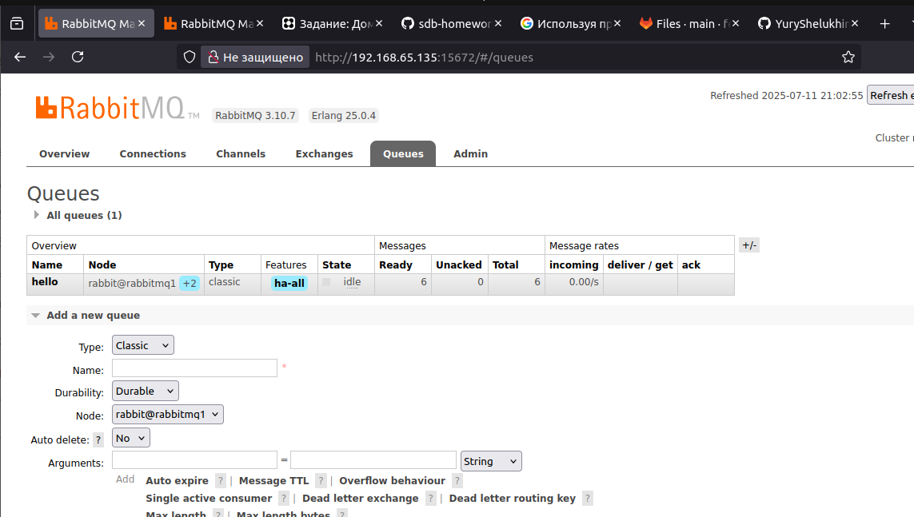
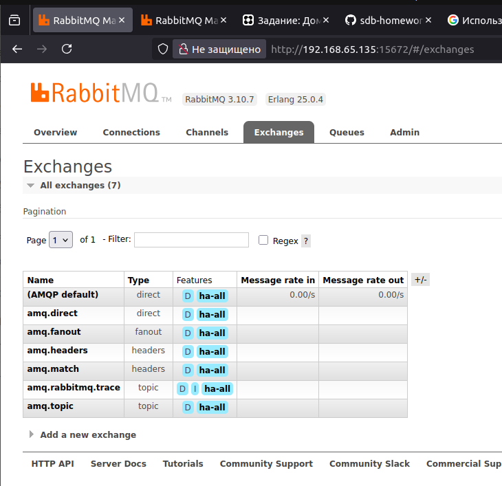

2. Проверим статусы нод кластера.
`root@rabbitmq1:/# rabbitmqctl cluster_status`  

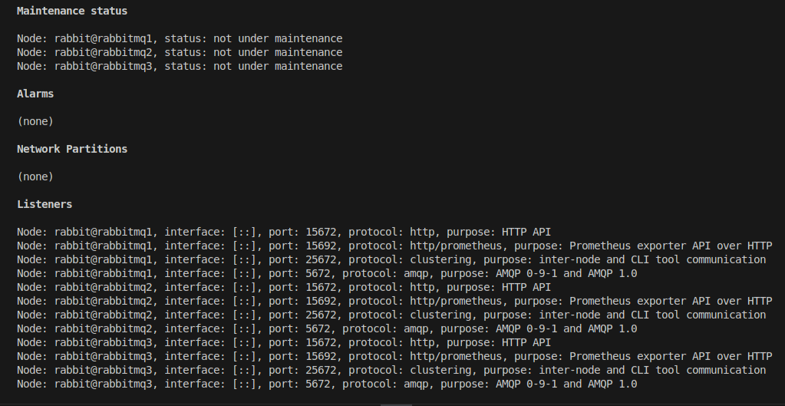
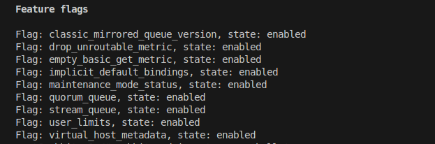  

`root@rabbitmq2:/# rabbitmqctl cluster_status`
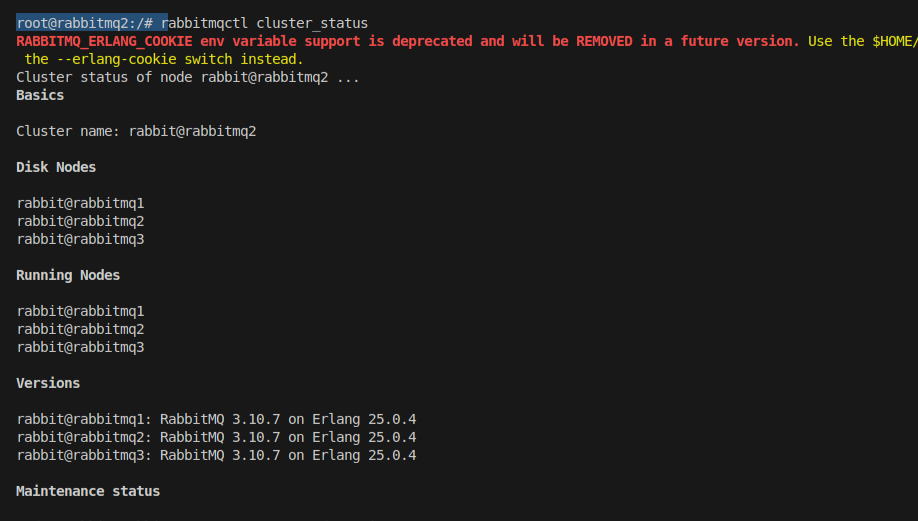
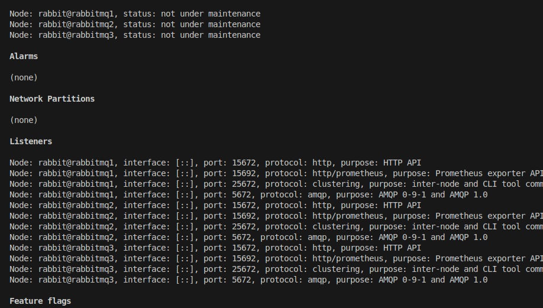
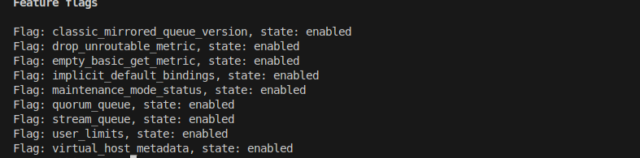

3. C помощью утилиты rabbitqadmin обратимся к очереди hello с разных нод.  
`root@rabbitmq1:/# rabbitmqadmin -u test -p test get queue='hello'`  
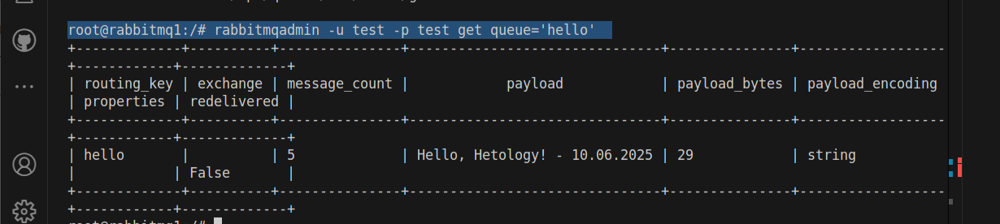  

`root@rabbitmq2:/# rabbitmqadmin -u test -p test get queue='hello'`  
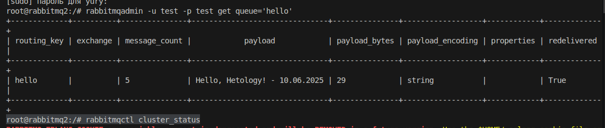     

4. Отключим одну ноду и запустим consumer.py на второй.    
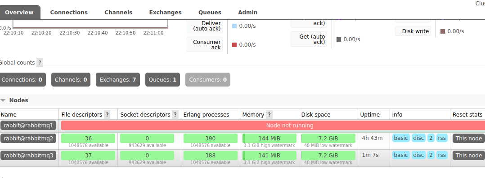    
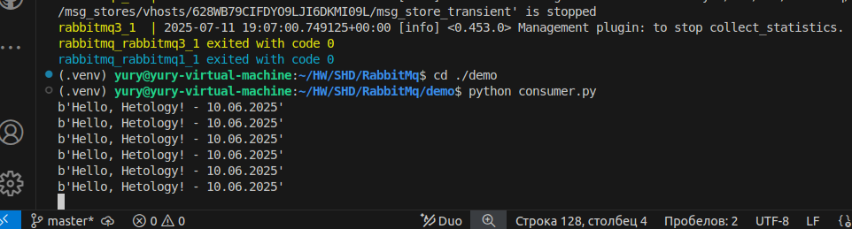 
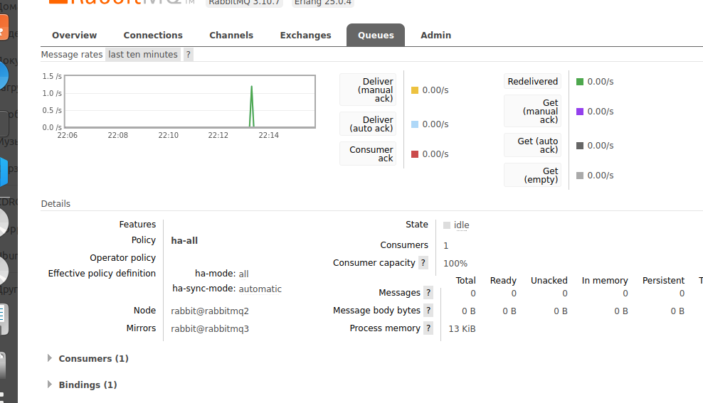

---

### * Задание 4. Ansible playbook

Напишите плейбук, который будет производить установку RabbitMQ на любое количество нод и объединять их в кластер.
При этом будет автоматически создавать политику ha-all.

*Готовый плейбук разместите в своём репозитории.*


---


### Решение 4*.
1. Исправим Logstash.conf:  
input {

  beats {  
    port => 5044  
    host => "0.0.0.0"  
    client_inactivity_timeout => 300 # Таймаут   неактивных соединений  
  }  
}  
Проверим:  
    
  


#### Конфигурационный файл.  
[конфигурация Docker-compose](docker-compose.yml)  


 
