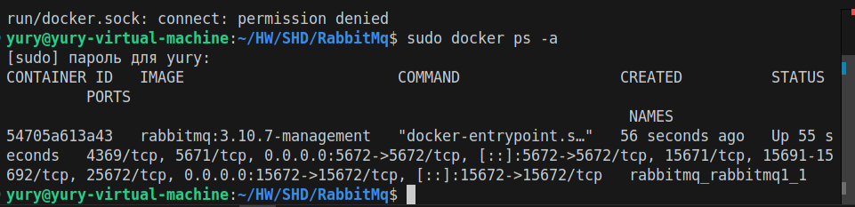
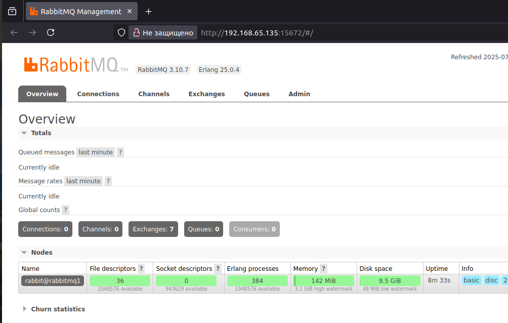
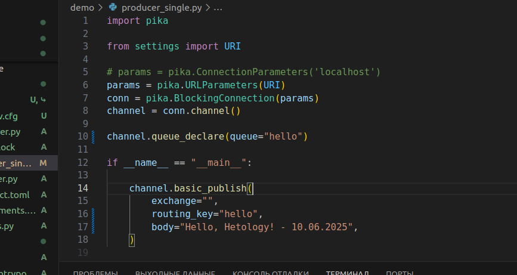
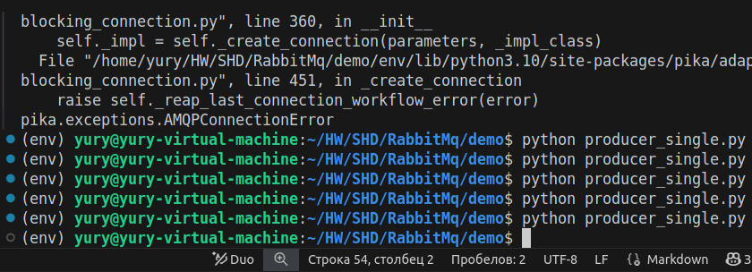
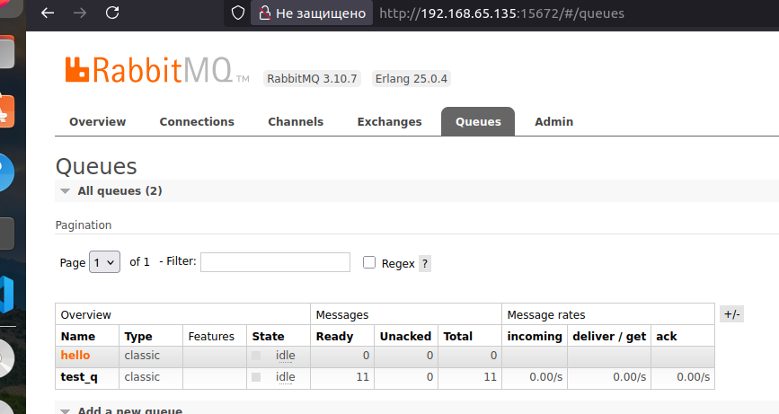
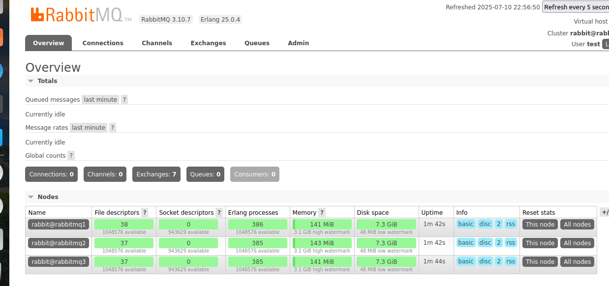
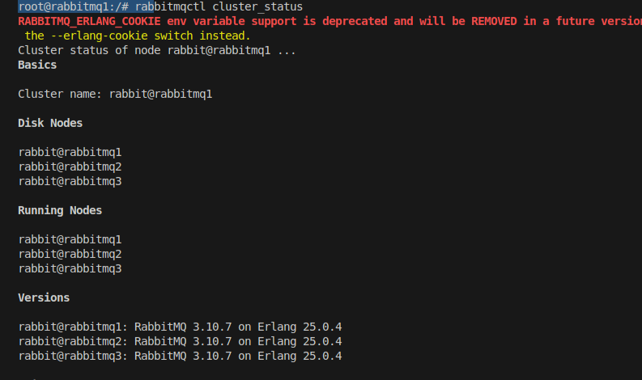

# Домашнее задание к занятию  «Очереди RabbitMQ» Шелухин Юрий

### Задание 1. Установка RabbitMQ

Используя Vagrant или VirtualBox, создайте виртуальную машину и установите RabbitMQ.
Добавьте management plug-in и зайдите в веб-интерфейс.
*Итогом выполнения домашнего задания будет приложенный скриншот веб-интерфейса RabbitMQ.*

---

### Решение 1.
1. Установим Docker    
`sudo apt  install docker-compose`
Установим стек ELK.  
`sudo docker-compose up`  
Через команду `docker ps -a` посмотрим список работающих контенейнеров, определим id elastic.  
   

2. Зайдем внутрь контейнера через команду `sudo docker exec -it 01834b15e04d bash` и командой `curl -u elastic:test -X GET 'localhost:9200/_cluster/health?pretty'` проверим конфигурацию (с указанием имени и пароля).  
    

Теперь поменяем имя кластера в конфигурационном файле, который прокидывается внутрь контейнера.  
    
    

4. Перезапустим один контейнер командой `sudo docker-compose restart elasticsearch` и вновь зайдем в него для проверки конфигурации.    


---


### Задание 2. Отправка и получение сообщений

Используя приложенные скрипты, проведите тестовую отправку и получение сообщения.
Для отправки сообщений необходимо запустить скрипт producer.py.

Для работы скриптов вам необходимо установить Python версии 3 и библиотеку Pika.
Также в скриптах нужно указать IP-адрес машины, на которой запущен RabbitMQ, заменив localhost на нужный IP.

```shell script
$ pip install pika
```

Зайдите в веб-интерфейс, найдите очередь под названием hello и сделайте скриншот.
После чего запустите второй скрипт consumer.py и сделайте скриншот результата выполнения скрипта

*В качестве решения домашнего задания приложите оба скриншота, сделанных на этапе выполнения.*

Для закрепления материала можете попробовать модифицировать скрипты, чтобы поменять название очереди и отправляемое сообщение.

---

### Решение 2.
1. Установим стек ELK.  
`sudo docker-compose up`  
Через команду `docker ps -a` посмотрим список работающих контейнейнеров, в том числе Kibana.  
  

2.   Обратимся к браузеру по адресу: http://192.168.65.135:5601/app/dev_tools#/console (или localhost вместо ip).    
         

Выполним запрос GET.   
  

#### Конфигурационный файл.  
[конфигурация Kibana](configs/kibana/config.yml)


### Задание 3. Подготовка HA кластера

Используя Vagrant или VirtualBox, создайте вторую виртуальную машину и установите RabbitMQ.
Добавьте в файл hosts название и IP-адрес каждой машины, чтобы машины могли видеть друг друга по имени.

Пример содержимого hosts файла:
```shell script
$ cat /etc/hosts
192.168.0.10 rmq01
192.168.0.11 rmq02
```
После этого ваши машины могут пинговаться по имени.

Затем объедините две машины в кластер и создайте политику ha-all на все очереди.

*В качестве решения домашнего задания приложите скриншоты из веб-интерфейса с информацией о доступных нодах в кластере и включённой политикой.*

Также приложите вывод команды с двух нод:

```shell script
$ rabbitmqctl cluster_status
```

Для закрепления материала снова запустите скрипт producer.py и приложите скриншот выполнения команды на каждой из нод:

```shell script
$ rabbitmqadmin get queue='hello'
```

После чего попробуйте отключить одну из нод, желательно ту, к которой подключались из скрипта, затем поправьте параметры подключения в скрипте consumer.py на вторую ноду и запустите его.

*Приложите скриншот результата работы второго скрипта.*

---

### Решение 3
1. Добавим в Docker-compose.yml конфигурацию Nginx:
   
Nginx:
    image: nginx:latest
    ports:
      - "80:80"
    volumes:
      - ./nginx_logs:/var/log/nginx
    networks:
      - elk    
    environment:
      - NGINX_USER=root
      - NGINX_ERROR_LOG_FILE=/var/log/nginx/error.log
      - NGINX_ACCESS_LOG_FILE=/var/log/nginx/access.log 
    restart: always`

    и добавим volume в Logstash:

`logstash:
    image: logstash:7.16.2
    volumes:
      - ./configs/logstash/config.yml:/usr/share/logstash/config/logstash.yml
      - ./configs/logstash/pipelines.yml:/usr/share/logstash/config/pipelines.yml
      - ./configs/logstash/pipelines:/usr/share/logstash/config/pipelines
##### - ./nginx_logs:/var/log/nginx`

Проверим, много раз исправим ошибки,в т.ч.:  
    - версия должна быть одинаковой у всех сервисов;  
    - настроим разные разрешения у конфиг файлов (777, 640);  
    - 7-ую версию проще настроить чем 8-ую;  
    - ищем логи `docker-compose exec logstash tail -n 5 /var/log/nginx/access.log` и т.д.;  
    - для теста фильтр лучше брать попроще;  
    - nginx на хосте занимает тот-же порт 80 что и в контейере (systemctl stop...),  
 при запуске получим:  
   
 

---

### * Задание 4. Ansible playbook

Напишите плейбук, который будет производить установку RabbitMQ на любое количество нод и объединять их в кластер.
При этом будет автоматически создавать политику ha-all.

*Готовый плейбук разместите в своём репозитории.*


---


### Решение 4*.
1. Исправим Logstash.conf:  
input {

  beats {  
    port => 5044  
    host => "0.0.0.0"  
    client_inactivity_timeout => 300 # Таймаут   неактивных соединений  
  }  
}  
Проверим:  
    
  


#### Конфигурационный файл.  
[конфигурация Docker-compose](docker-compose.yml)  


 
